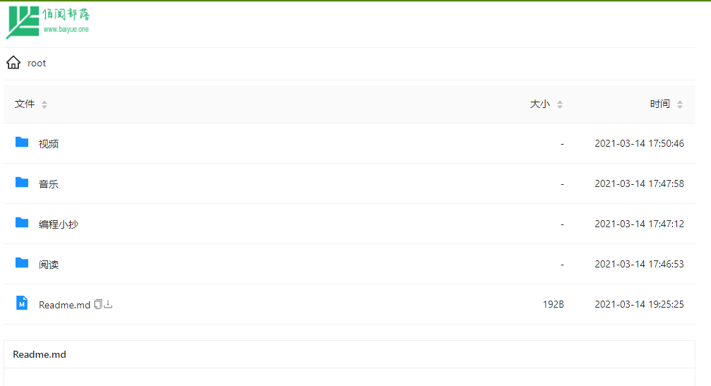
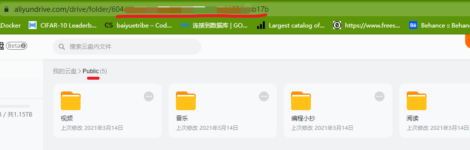
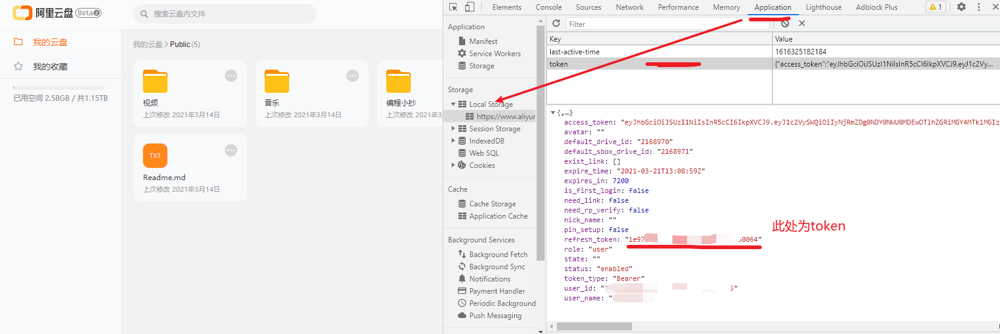

# ALIST
 一款基于go+vue的阿里云盘,支持在线播放视频音乐，在线浏览文档图片。直连地址为阿里云oss，当前不限速，体验友好。

## 项目说明
最近学习go语言的过程中，最大的感触是语法虽少但是上手比较困难，正好看到这个项目，采用前后端分离开发，前端vue+后端go语言用的gin框架。所以，为了让自己掌握go语言，我使用go语言最新的fiber框架重构了后端，前后端都移除了部分功能。

## 在线演示地址：
https://pan.baiyue.one



## 部署方法
1. 下载本项目到服务器
```
下载地址： https://pan.baiyue.one/d/root/开源代码/alist.zip
```

2. 解压后设置env.yml的配置文件
需要配置的已经中文标注了。其中logo可以使用网址，随便找个图床即可；
网盘的根目录，比如在阿里云盘网页版创建任意文件夹，点击打开后，复制地址栏里的数字即可；

token参数，在浏览器里，按下F12打开调试工具，然后


3. 启动服务
打开终端，运行下面的脚本即可
```
bash start.sh
```
如需刷新页面文件，同样输入以上命令完成重启操作。


## 参考项目
- https://github.com/Xhofe/alist